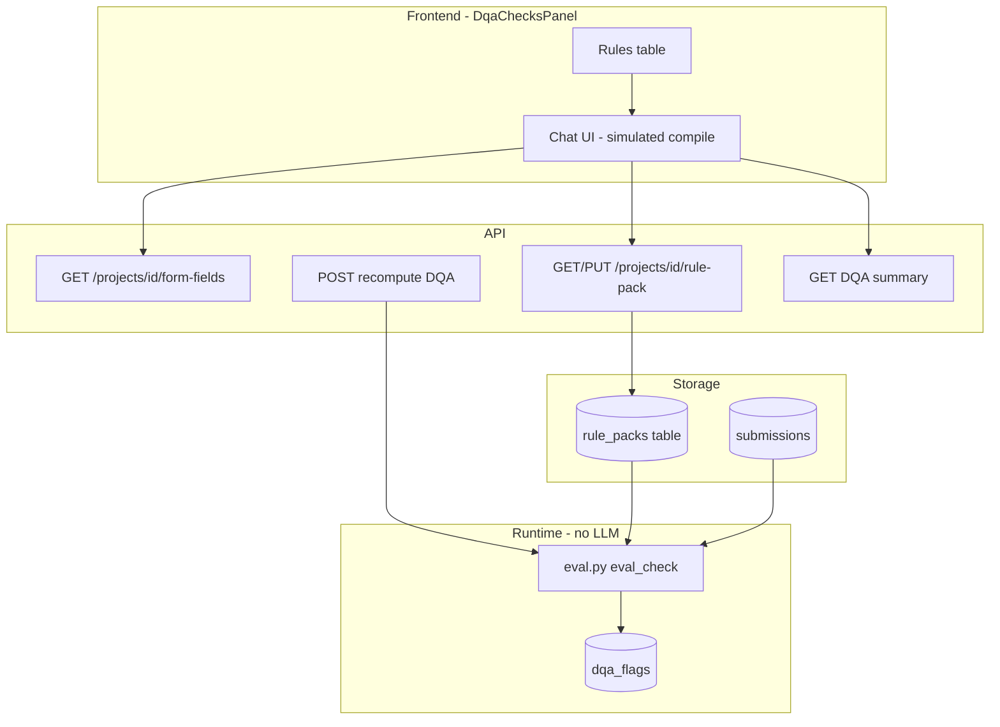
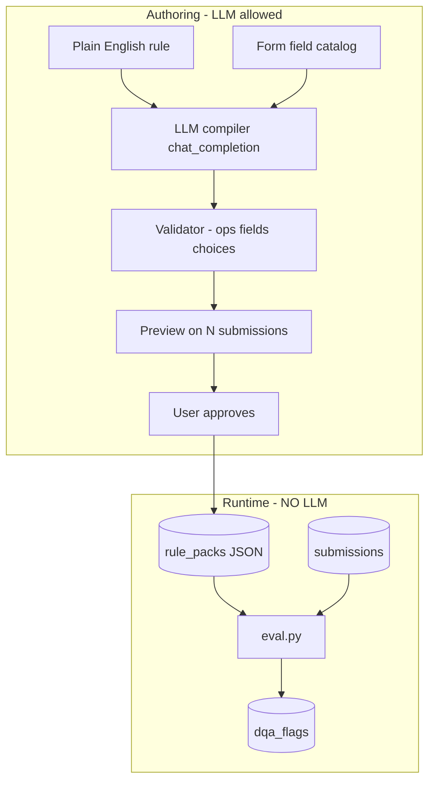
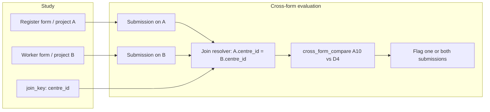

# InfoSutra DQA: Inter-Form Rules and LLM Authoring Architecture

**Audience:** External architects with no prior InfoSutra knowledge  
**Status:** As of September 2026 — current implementation + target design  
**Scope:** Data Quality Assessment (DQA) rule authoring, compilation, and evaluation

---

## 1. Executive summary

**InfoSutra** is a field-data platform used by research and M&E teams to collect, monitor, and analyse survey data from KoBoToolbox. A **study** is a multi-tool evaluation (e.g. a baseline with several questionnaires). Each **KoBo form** syncs into InfoSutra as a **project** (one project per form). **Submissions** are individual completed records from enumerators in the field.

**Data Quality Assessment (DQA)** automatically flags suspect submissions against a configurable set of rules. Each form has exactly **one rule pack** stored in the database. At runtime, rules are evaluated **deterministically** by a closed operator catalog — no LLM is invoked when flagging submissions.

**What we are building:** Plain-English rule authoring backed by an LLM **compiler** that runs only at authoring time. Field teams describe checks in natural language (matching how requirement documents arrive); the system resolves KoBo field codes, validates against the engine, previews on live submissions, and saves compiled JSON to the rule pack. Runtime evaluation remains unchanged.

| Dimension | Current state (today) | Target state |
|-----------|---------------------|--------------|
| Rule authoring | UI mock: chat-style flow with **simulated** compile (no real LLM call) | Real LLM compile + validator + preview before save |
| Rule storage | One JSON rule pack per form in `rule_packs` table; YAML seeds (e.g. `teachers.yml`) | Same schema; English text stored alongside compiled `check` tree |
| Runtime eval | `eval.py` operator catalog on each submission | Unchanged — deterministic, auditable |
| Inter-form rules | Not supported in engine or UI | Deferred past v1; requires cross-submission eval and join resolution |
| CMF study coverage | 3 of 5 requirement rules achievable intra-form once engine gaps closed | 5 of 5 after Phase 2 inter-form work |

The architectural invariant: **LLM at compile time only; deterministic evaluation at runtime.**

---

## 2. Product context

### Studies, forms, and submissions

| Concept | Meaning |
|---------|---------|
| **Study** | Top-level container for an evaluation (e.g. CMF baseline). Holds multiple KoBo forms/tools. |
| **Project / form** | One synced KoBo form. Has a form definition (XLSForm-derived schema), submissions, and its own rule pack. |
| **Submission** | One completed record. Evaluated independently against that form's rule pack. |
| **Rule pack** | JSON document: field aliases, thresholds, and a list of rules. One pack per project, keyed by `project_id`. |

### Data Quality section

The **Data Quality** area (`/dqa`) is the single place for quality monitoring. A form selector at the top scopes all tabs to one project.

| Tab | Purpose |
|-----|---------|
| **Coverage** | Rule hit rates; drill into flags by rule |
| **DQA flags** | Flagged submissions with severity (RED / AMBER) |
| **Enumerators** | Per-enumerator submission counts and flag rates |
| **Rules** | Per-form rule pack authoring (this document's focus) |
| **Triangulation** | Cross-form analysis views — aggregate concordance between linked forms (separate from row-level DQA flags) |

Legacy routes (`/forms/:id/rules`, `/projects/:id/rules`) redirect to `/dqa?projectId=:id&tab=rules`.

### Runtime evaluation model

1. On save or manual recompute, each submission is passed through `eval_check()` for every rule in that form's pack.
2. A failing check produces a **flag** with rule id, severity, message, and diagnostic details.
3. Evaluation uses only the compiled `check` JSON tree — never an LLM.
4. Some operators (e.g. `unique_in_project`, `group_count_lte`) need **project-scoped context** (all submissions for that form) but still operate within a single form.

---

## 3. Current implementation (as of today)

### 3.1 Rules tab UI — `DqaChecksPanel.tsx`

The Rules tab embeds `DqaChecksPanel` when a form is selected. Two views:

**Table view (default):** Compact list with columns `# | Rule | Status | Actions`. Toolbar includes Help, disabled Upload docx, and **Add rule in English**. Each row shows the rule's English text and status (`compiled` vs `draft`). Actions: Edit via chat, Delete.

**Add / edit view:** Full-screen ChatGPT-style chat (`RuleAuthoringChat`). Flow:

1. User describes rule in English (3-turn conversation: intent → tolerance → preview).
2. **Simulated** thinking steps ("Parsing rule intent…", "Matching field codes…", etc.) and streamed assistant replies — **no backend LLM call yet**.
3. Inline cards: sample form fields, preview stats (current flags / submissions checked), collapsible compiled JSON.
4. **Add rule / Save rule** persists to the rule pack via `useUpdateProjectRulePack`, then triggers `useRecomputeDqa`.

On approve, new rules are saved with placeholder check `{ op: "pending_compile" }` or `{ op: "blank", field: … }` — real compilation is not wired.

**API hooks used:**

- `useGetProjectFormFields` — field catalog for the selected form
- `useGetProjectRulePack` / `useUpdateProjectRulePack` — read/write pack
- `useGetDqaSummary` — preview stats
- `useRecomputeDqa` — re-run evaluation after save

### 3.2 DQA dashboard integration — `DqaDashboard.tsx`

Five tabs under Data Quality. URL syncs `tab` and `projectId` query params. Rules tab renders `DqaChecksPanel` when `projectId` is set; otherwise prompts to select a form.

### 3.3 Rule pack storage — `dqa_rule_packs.py`

| Function | Role |
|----------|------|
| `load_seed_packs()` | Reads YAML files from `app/rule_packs/*.yml` |
| `get_pack_for_project()` | DB lookup in `rule_packs` table; falls back to seed matching `project_uids` |
| `seed_rule_packs()` | Imports seeds into DB for matching projects |
| `save_pack()` | Upserts pack JSON for a project |

Storage model: **one row per project** in `rule_packs`, column `pack` (JSONB).

### 3.4 Rule pack schema — `teachers.yml` example

```yaml
id: teachers
project_uids: [a5qKLPgxnHTaYbrDWeeg9v]
join_key: udise                    # Used for cross-submission ops within form
fields:                            # Logical alias → KoBo field name
  consent: K_CONSENT
  udise: K_INST_ID
  knowledge_inclusion: B1
thresholds:
  min_duration_minutes: 20
rules:
  - id: T2-1
    severity: red
    title: Consent recorded
    message: Consent missing or No but responses exist
    check:
      op: if_then
      if: { op: any_section_filled, prefix: "con1/" }
      then: { op: equals_any, field: consent, values: ["1", "yes", "Yes"] }
```

Each rule has: `id`, `severity` (red/amber), `title`, `message`, and a composable `check` tree. Field references use pack-level aliases or raw KoBo names.

### 3.5 Evaluation engine — `eval.py` operator catalog

`eval_check(check, data, pack, project_rows, current)` returns `(passes: bool, details: dict)`. Flag when `passes` is False.

**Composition operators:**

| Operator | Semantics |
|----------|-----------|
| `all` | All child checks must pass |
| `any` | At least one child must pass |
| `not` | Inverts inner check |
| `if_then` | If antecedent passes (condition true), consequent must pass; else N/A |

**Field-level operators:**

| Operator | Semantics |
|----------|-----------|
| `required` | Field must not be blank |
| `blank` | Field must be blank |
| `equals` / `not_equals` | String equality (case-insensitive) |
| `equals_any` / `in` / `not_in` | Value in/forbidden set |
| `regex` | Full-match pattern |
| `min_length` | Minimum string length |
| `between` | Numeric range (supports threshold refs) |
| `gt` / `lt` / `gte` / `lte` | Compare field to constant or threshold |
| `integer` | Whole-number string |
| `any_section_filled` | Any field under prefix has data |
| `exclusive_choice` | Exclusive option must not co-occur with others |
| `selected_count_lte` | Multi-select count cap |
| `skip_residue` | Child fields blank when parent indicates skip |
| `all_equal` | Straight-lining detection across field list |
| `match_density_gt` | Percentage of fields matching values |
| `specify_valid` | Free-text required when trigger choice selected |

**Time / meta operators:**

| Operator | Semantics |
|----------|-----------|
| `duration_minutes_gte` | Minutes between start/end fields vs minimum |

**Project-scoped operators (single form):**

| Operator | Semantics |
|----------|-----------|
| `unique_in_project` | Field value appears at most once across form submissions |
| `group_count_lte` | Count of submissions sharing field value ≤ max |

**Attachment / geo:**

| Operator | Semantics |
|----------|-----------|
| `gps_present` | Geolocation or location record exists |
| `attachment_count_gte` | Minimum attachment count |

**Not yet implemented (required for CMF):**

- `compare_fields` — field A vs field B (e.g. `B22 > B21`)
- `duration_between` — min/max band between arbitrary time fields (e.g. `B2`–`B3`)

Unknown operators log a warning and pass (do not flag).

### 3.6 LLM plugin model — `app/integrations/llm/`

Thin wrapper; features never call vendors directly.

| Module | Role |
|--------|------|
| `types.py` | `LlmConfig`, `CompletionParams`, `ChatMessage` |
| `registry.py` | `register_plugin()`, `PROVIDER_PLUGIN_MAP` (openrouter/openai/azure → `openai_compat`) |
| `plugins/openai_compat.py` | OpenAI-compatible `/chat/completions` client |
| `settings.py` | `llm_config_from_app_settings()` from app settings |
| `__init__.py` | `chat_completion(config, messages)` — single entry point |

Adding a vendor: implement `LlmProviderPlugin`, register in `registry.py`.

### 3.7 Existing LLM uses (not DQA compile)

| Feature | Service | Purpose |
|---------|---------|---------|
| **Insights** | `routers/insights.py` | Natural-language Q&A over study context + recent submissions |
| **DQA Daily narratives** | `dqa_daily_narratives.py` | AI headline and coverage note for daily DQA reports |
| **DQA Final narratives** | `dqa_final_narratives.py` | End-of-study narrative summary |

All use `chat_completion()` with structured prompts and fallback when AI is disabled or key missing. DQA rule compile will follow the same pattern.

### 3.8 Form fields API

`GET /projects/{project_id}/form-fields` returns synced KoBo schema:

- Parses `project.form_definition.survey` and `choices`
- Returns `{ name, type, label, list_name, choices[] }` per field
- Appends synthetic `start` / `end` datetime fields

Used by the authoring UI to show field samples and (target) feed the LLM compiler context. Does not include submission PII.

---

## 4. Requirement types: intra-form vs inter-form

DQA rules fall into two scopes. The distinction drives UI boundaries, compiler context, and engine design.

### 4.1 Intra-form rules

**Definition:** All referenced fields exist on **one submission** from **one form**. Evaluation is O(1) per submission.

| CMF example | Plain English | Fields involved |
|-------------|---------------|-----------------|
| Tool-1 B21 vs B22 | Flag when participation at 45 min exceeds participation at 15 min | `B22`, `B21` (same observation form) |
| Tool-1 B2–B3 | Session duration unusually short or long | `B2`, `B3` (start/end times) |
| Tool-2 B1–B6 vs B7 | Father ticked in any activity multi-select but "did father participate" is No | `B1`–`B6`, `B7` |
| Tool-3 A3/A4 vs A4_1 | Vacancy reported Yes but headcount is zero | `A3`, `A4`, `A4_1` |

**Compiled shape:** Standard `check` tree using existing or new intra-form operators (`compare_fields`, `duration_between`, `if_then` + `any` + `equals`).

### 4.2 Inter-form rules

**Definition:** Compare values from **two different forms** (two projects) for the **same logical entity**, joined by a shared key (e.g. centre ID, UDISE code).

| CMF example | Plain English | Forms involved |
|-------------|---------------|----------------|
| Tool-1 A10 vs D4 | Register count of children present (3–6 years) must match worker-reported count | Register form (`A10`) vs Worker interview form (`D4`), joined on **centre** |

**Compiled shape must express:**

- `form_a`, `field_a` — source form and field
- `form_b`, `field_b` — target form and field
- `join_key` — field(s) used to pair submissions (e.g. `centre_id`)
- `relation` — eq, ne, gt, within tolerance
- Optional tolerance for numeric comparison

### 4.3 Contrast summary

| Aspect | Intra-form | Inter-form |
|--------|------------|------------|
| Submission scope | One | Two (paired) |
| Form scope | One project | Two projects in same study |
| Eval unit | Single submission | Submission pair |
| UI context | Per-form Rules tab | Study-level linkage + both schemas |
| Engine | Existing `eval_check` loop | New cross-submission resolution |
| CMF count | 4 of 5 rules | 1 of 5 rules (A10 vs D4) |

---

## 5. Inter-form requirements in detail

### 5.1 Business rule — CMF Tool-1 A10 vs D4

**What it means:** At each anganwadi centre, the number of 3–6 year-olds marked present in the **register** (Section A, field A10) should agree with the number reported by the **worker** in the interview ("how many children came today", field D4). A mismatch suggests data entry error, wrong centre, or inconsistent reporting.

### 5.2 What the compiled rule must express

```json
{
  "id": "T1-A10-D4",
  "severity": "red",
  "title": "Register vs worker child count",
  "message": "A10 (register present) does not match D4 (worker reported)",
  "check": {
    "op": "cross_form_compare",
    "join_key": "centre_id",
    "form_a": "<register_project_uid>",
    "field_a": "A10",
    "form_b": "<worker_project_uid>",
    "field_b": "D4",
    "relation": "eq",
    "tolerance": 0
  }
}
```

(Exact op name TBD; conceptually a cross-form variant of `compare_fields`.)

### 5.3 CMF deployment nuance

CMF Tool-1 may be deployed as:

1. **Single mega-form** — register (E0), observation (E2), and worker interview (E5) sections in one KoBo form. In this case A10 and D4 are on the **same submission**; the rule is **intra-form** and needs only `compare_fields`.
2. **Separate KoBo forms** — register and worker interview synced as distinct projects. A10 and D4 are on **different submissions** linked by centre ID. This is true **inter-form** and needs join resolution at evaluation time.

The authoring system must not assume one layout. The LLM compiler should detect which fields live on which synced forms and classify the rule accordingly. If forms are split, the compiler must require an explicit join key present on both forms.

---

## 6. Why inter-form is hard

Structured for architects evaluating feasibility and sequencing.

### 6.1 Context boundary: per-form UI vs study-level linkage

Today's Rules tab is **scoped to one project**. Field schema comes from `GET /projects/{id}/form-fields`. Inter-form rules need:

- All form schemas in the study (names, types, labels, choices)
- Study-level join key configuration (which field on each form maps to the same entity)
- Storage location: rule pack of form A only, form B only, or a new study-level pack?

Each choice affects API design, UI navigation, and recompute triggers.

### 6.2 Compiler needs multi-form schema + join metadata

The LLM compiler prompt must include schemas for **both** forms plus known join keys. Field disambiguation is harder: `D4` on the worker form vs unrelated `D4` on another tool. The validator must confirm both fields exist, types are compatible (integer vs integer), and the join key is populated on both sides.

### 6.3 Engine gaps

| Gap | Detail |
|-----|--------|
| `compare_fields` | `gt`/`lte` today compare a field to a **constant**, not another field |
| Cross-submission eval | `eval_check` receives one `data` dict; no pairing logic |
| Join resolution | No service to find submission B given submission A's join key value |
| Flag semantics | Which submission(s) get flagged — one, both, or a synthetic pair flag? |
| Recompute scope | Changing an inter-form rule may require re-evaluating **both** forms' submissions |

### 6.4 Preview complexity

Intra-form preview: run check on last N submissions of one form.

Inter-form preview: for each submission on form A, find candidate submission(s) on form B with matching join key; evaluate pairwise; report match rate and example mismatches. Edge cases: missing counterpart, duplicate join keys, null join values.

### 6.5 LLM ambiguity

Natural language like "consistency between A10 and D4" does not specify:

- Which form each field belongs to (if not obvious from schema)
- Join key (centre vs block vs date)
- Tolerance (exact match vs ±1 for timing/count drift)
- Severity and message text

The chat disambiguation loop (already mocked in UI) is **essential** for inter-form, not optional.

### 6.6 Authoring vs runtime separation

Inter-form does not change the invariant: LLM compiles once; runtime is deterministic. It **does** require new deterministic ops (`cross_form_compare` or equivalent) that the validator whitelists. LLM must never run during batch recompute or daily flagging.

---

## 7. Why we defer inter-form in v1

Honest tradeoffs for a first shippable LLM authoring release.

### 7.1 What works without inter-form

Four of five CMF DQA rules are intra-form:

| Rule | Achievable in v1 (after engine ops) |
|------|-------------------------------------|
| B21 vs B22 | Yes — `compare_fields` |
| B2–B3 duration | Yes — `duration_between` |
| B1–B6 vs B7 | Yes — `if_then` + `any` + `in` (engine ready today) |
| A3/A4 vs A4_1 | Yes — `if_then` + `any` + `equals` (engine ready today) |
| A10 vs D4 | **Only if** same submission; otherwise Phase 2 |

If CMF deploys Tool-1 as a single form, v1 covers all five. If split across forms, v1 covers four — sufficient to validate the authoring pipeline end-to-end.

### 7.2 Rationale for gating

| Factor | Intra-form v1 | Inter-form |
|--------|---------------|------------|
| Engine work | 2 new ops | 2 ops + pairing + join service + flag model |
| UI work | Single-form chat (mostly built) | Study schema, join picker, pair preview |
| Risk | Validator + LLM field resolution | Join ambiguity, duplicate keys, partial data |
| User value | Immediate for most rules per study | One rule type, study-specific deployment uncertainty |

Shipping intra-form compile + validate + preview first delivers the core UX bet (English → compiled JSON → flags) without blocking on cross-form infrastructure.

---

## 8. Proposed phased approach

### Phase 1 — Intra-form compile, validate, preview

**Engine:**

- Add `compare_fields` (`field_a`, `field_b`, `relation`, optional `tolerance`)
- Add `duration_between` (`start_field`, `end_field`, `min_minutes?`, `max_minutes?`)

**Compiler service:**

- New backend endpoint: accept English + form schema → call `chat_completion()` → return structured rule JSON
- Validator: JSON schema, op whitelist (`eval.py` catalog), field existence, choice code resolution
- Preview: run compiled check on last N submissions; return flag count + examples

**UI:**

- Replace simulated chat in `DqaChecksPanel` with real compile API
- Store `english` + compiled `check` on approve
- CMF acceptance fixtures for 4 intra-form rules (5 if single-form deployment)

**LLM stack:** Use existing `app/integrations/llm/` — no new vendor coupling.

### Phase 2 — Engine ops + cross-form evaluation

- Implement `cross_form_compare` (or extend `compare_fields` with form refs)
- Join resolution service (study config or per-pack `join_key`)
- Pairwise eval during recompute for both forms
- Flag model: which submission(s) to attach flag to; related submission refs in details (pattern exists in `unique_in_project`)

### Phase 3 — Inter-form compiler context + pair preview

- Compiler prompt includes all study form schemas + join keys
- Inter-form validator rules (both forms present, join key on both, type compatibility)
- Pair preview API for authoring chat
- Optional docx import: CMF-style table → batch draft rules

### Phase 4 — Scale (optional)

- Prompt template versioning in Settings
- Recompile-all on prompt change
- Advanced YAML edit for InfoSutra staff only

---

## 9. Architecture diagrams

### 9.1 Current flow (today)



### 9.2 Target compile flow (Phase 1)



### 9.3 Inter-form data flow (Phase 2+)



---

## 10. Decisions and open items

### Locked (product sign-off)

| # | Topic | Decision |
|---|--------|----------|
| 1 | **Streaming compile** | v1: **request/response only**; UI simulated stream until v2 |
| 2 | **Compile model** | **Separate compile-only model** in Settings (not shared with narratives/Insights) |
| 4 | **Prompt storage** | **Prompt templates table from day one** — category `dqa-compile`, `/prompts` UI |

### Pending

| # | Topic | Status |
|---|--------|--------|
| 3 | **Inter-form scope in v1** | Awaiting product direction |

### Still open (implementation detail)

| Decision | Considerations |
|----------|----------------|
| **Inter-form pack location** | Study-level pack vs duplicate rule on both forms |
| **Join key source** | Per-pack `join_key` vs study config vs triangulation views |
| **docx import timing** | Phase 1 batch vs Phase 3 |
| **Failed compile behaviour** | Block save vs save as draft with `_draft: true` |
| **Preview data privacy** | Schema-only to LLM; preview on submissions via local API |

---

## Appendix A: CMF rules reference

| Tool | Rule | Type | Engine today |
|------|------|------|--------------|
| Tool-1 | A10 vs D4 | Inter-form (if split) or intra (if mega-form) | Needs `compare_fields` or cross-form |
| Tool-1 | B2–B3 duration | Intra-form | Needs `duration_between` |
| Tool-1 | B21 vs B22 | Intra-form | Needs `compare_fields` |
| Tool-2 | B1–B6 vs B7 | Intra-form | Composable today |
| Tool-3 | A3/A4 vs A4_1 | Intra-form | Composable today |

## Appendix B: Key source files

| Area | Path |
|------|------|
| Rules UI | `artifacts/infosutra/src/pages/dqa/DqaChecksPanel.tsx` |
| DQA dashboard | `artifacts/infosutra/src/pages/dqa/DqaDashboard.tsx` |
| Evaluation engine | `artifacts/api-python/app/domain/dqa/eval.py` |
| Rule pack service | `artifacts/api-python/app/services/dqa_rule_packs.py` |
| Seed example | `artifacts/api-python/app/rule_packs/teachers.yml` |
| Form fields | `artifacts/api-python/app/domain/dqa/form_fields.py` |
| LLM integration | `artifacts/api-python/app/integrations/llm/` |
| DQA narratives | `artifacts/api-python/app/services/dqa_daily_narratives.py` |
| Insights LLM | `artifacts/api-python/app/routers/insights.py` |

---

*Document maintained by the InfoSutra engineering team. For implementation status, see the DQA Framework Fit plan and open todos for engine ops and Phase 1 compiler wiring.*
